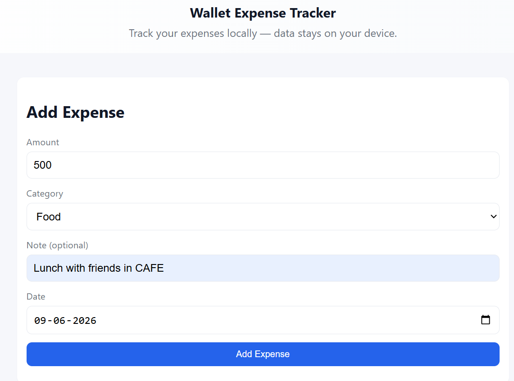
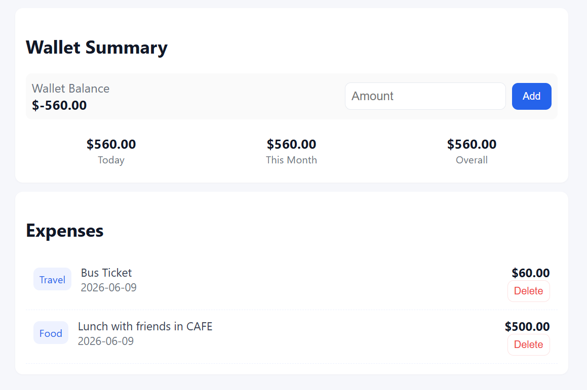
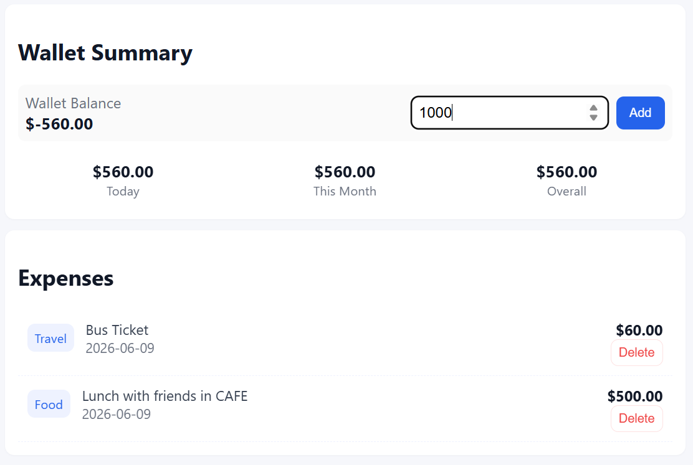
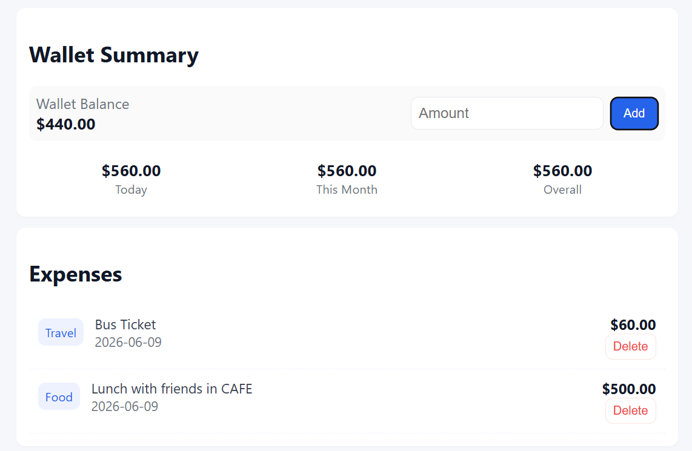

# Wallet Expense Tracker

A modern, responsive, privacy-first local expense tracker and wallet manager built with pure HTML5, CSS3, and Vanilla JavaScript. 

All your transaction details stay completely on your device, persisted using your browser's local storage.

---

## 🚀 Features

- 💼 **Wallet Management**: Initialize a wallet balance, add funds, and automatically deduct from or refund to your balance when adding or deleting expenses.
- 📝 **Detailed Expense Logging**: Record transactions with an amount, category (Food, Travel, Bills, Shopping, Other), optional notes, and custom dates (defaults to today).
- 📊 **Dynamic Dashboard**: Instantly view your current Wallet Balance along with total expenses compiled for **Today**, **This Month**, and **Overall**.
- 📋 **Interactive Transaction History**: Displays all logged expenses with the latest transactions on top, category tags, notes, and an easy delete option.
- 📱 **Fully Responsive Design**: Optimized layout for both desktop and mobile screens.
- 🔒 **Privacy-First**: No backend, no accounts, and no tracking. All data is stored locally using `localStorage`.

---

## 🌐 Live Demo

The application is deployed and ready to use at:
👉 **[expense-trackerdarshan.vercel.app](https://expense-trackerdarshan.vercel.app/)**

Since the app runs entirely in your browser, all your data stays private and is stored locally in your browser's local storage.

---

## 📸 Application Walkthrough

Here is a quick glimpse of how the Wallet Expense Tracker works:

### 1. Adding an Expense
You can easily log expenses by entering an amount, selecting a category, adding an optional note (e.g., *Lunch with friends in CAFE*), and choosing the date.


### 2. Live Dashboard & History Update
As soon as you add expenses (such as the Cafe lunch and a Bus ticket), they appear in the transaction history. The **Wallet Summary** automatically calculates and displays your spending for Today, This Month, and Overall.


### 3. Adding Funds to Wallet
When you receive money (e.g., from parents, salary, or a friend), you can add funds directly to your wallet using the amount input field.


### 4. Updated Wallet Balance
The wallet balance instantly reflects the added funds. Any subsequent expenses will be deducted from this balance, and deleting an expense will automatically refund it.


---

## 💾 Data Model

Expenses are saved in `localStorage` under the key `'expenses'` as an array of objects structured as follows:

```json
{
  "id": 1686255833000,
  "amount": 25.50,
  "category": "Food",
  "note": "Lunch with team",
  "date": "2026-06-08"
}
```

Wallet balance is persisted separately under the key `'wallet_balance'`.
